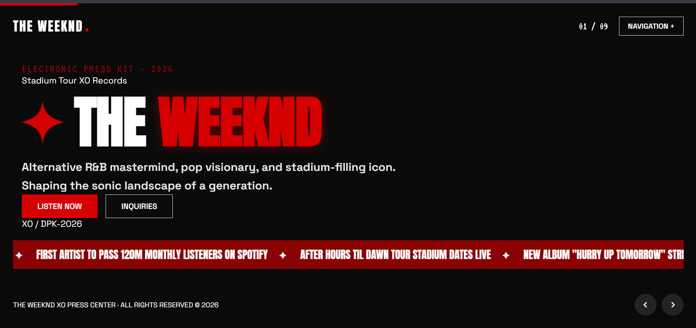

# The Weeknd - EPK & Streaming Hub

Hey! This is a mobile-ready digital press kit (EPK) for The Weeknd (XO). The idea was to create a cinematic viewing experience that aligns with the vibe of After Hours and Hurry Up Tomorrow, with a simple and seamless browsing experience. The project was built from scratch and is part of #horizons.

Features
*Multi-Method Navigation: You can navigate between the 9 slides using buttons, swipes on your mobile device, or even the keyboard.

*Live UI Updates: Slide number (01/09) and the progress bar update in real time as you move between pages using JavaScript.
*Streaming Portal (Slide 09): A dedicated page that brings together all official streaming platforms like Spotify, Apple Music, and YouTube in one place.
*Smooth Content Animation: Elements appear gradually with each slide using `data-reveal` for smoother animation.

$ Tech Stack
* HTML5: Simple and organized structure.
* CSS3: Color variables, Flexbox for arrangement, and `clamp()` for font responsiveness across all screens.
* Vanilla JavaScript: Simple JS code running within IIFE to control the slider, keyboard, and swipe gestures without any external libraries.

$ How to Explore
* Use the arrows, navigation buttons, or the top menu.

* Keyboard: Right/Left arrows, Spacebar, or the numbers 1-9 for quick navigation.
* On mobile: Swipe left or right to switch between slides.
----------------------

